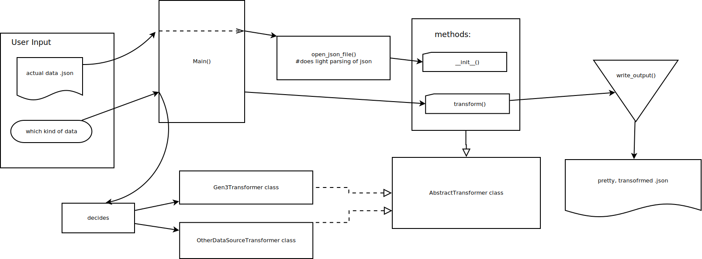

# newt-transformer

Metadata transformer to convert from gen3 to something readable by 
cgp-dss-data-loader

## Common Setup

1. Clone the repo:

   `git clone https://github.com/jessebrennan/newt-transformer.git`

2. Go to the root directory of the cloned project:

   `cd newt-transformer`

3. Run:

    `pip install .`

## Setup for Development
1. Clone the repo:

   `git clone https://github.com/jessebrennan/newt-transformer.git`

2. Go to the root directory of the cloned project:

   `cd newt-transformer`

3. Run (ideally in a new [virtual environment](https://docs.python.org/3/tutorial/venv.html)):

   `make develop`

## Running Tests
1. make sure you followed Setup for Development

2. Run:

   `make test`

## Transforming data from sheepdog-exporter
1. The first step is to extract the Gen3 data you want using the
   [sheepdog exporter](https://github.com/david4096/sheepdog-exporter). The TopMed public data extracted
   from sheepdog is available [on the release page](https://github.com/david4096/sheepdog-exporter/releases/tag/0.3.1)
   under Assets. Assuming you use this data, you will now have a file called `topmed-public.json`

2. Make sure you are running the virtual environment you set up in the **Setup** instructions.

3. Now we need to transform the data. From the root of the project run:

   `newt new /path/to/topmed-public.json --output-json transformed-topmed-public.json`

   This will generate a transformed output file called `transformed-topmed-public.json`.

   The `new` argument specifies that we want the most recent version of the transformer output format.
   It can be replaced with a `gen3` argument, but this older format will soon be deprecated.

4. Likely you want to upload this data to the DSS. Instructions for this can be found  at
   [the DSS data loader repo](https://github.com/DataBiosphere/cgp-dss-data-loader).

## Transformer Architecture

